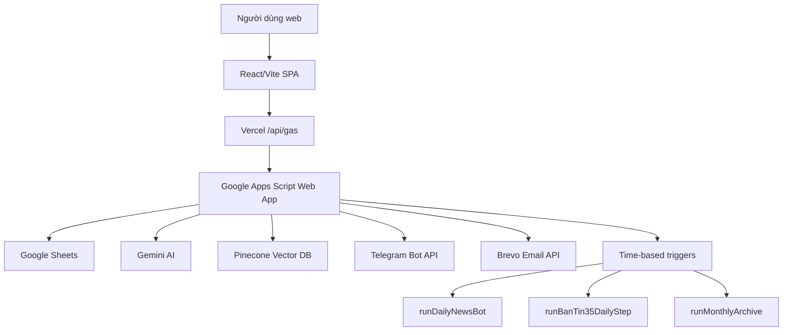
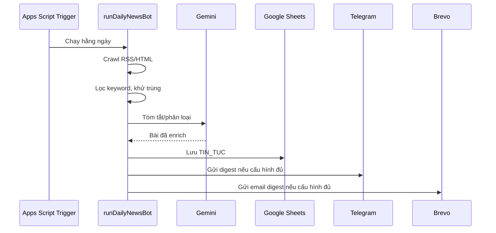
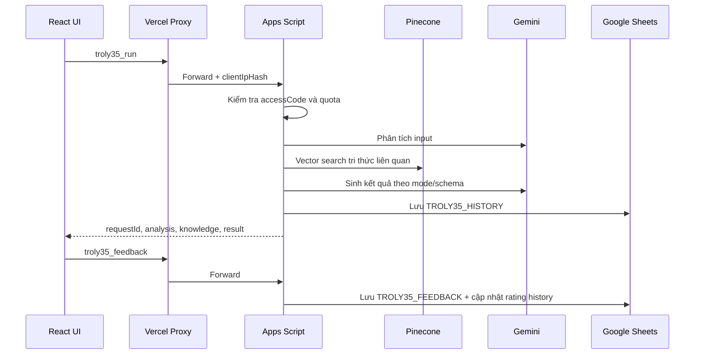

# Trợ lý 35 - Bảo vệ nền tảng tư tưởng

Hệ thống hỗ trợ công tác bảo vệ nền tảng tư tưởng trên môi trường số, gồm ứng dụng web React, backend Google Apps Script, cơ sở dữ liệu Google Sheets, tích hợp Gemini AI, Pinecone RAG, Telegram và Brevo Email.

> Dự án phục vụ nghiệp vụ nội bộ. Không commit khóa API, mã truy cập, token Telegram, token Vercel hoặc nội dung nhạy cảm vào repository.

## Mục lục

- [Tổng quan](#tổng-quan)
- [Tính năng chính](#tính-năng-chính)
- [Kiến trúc](#kiến-trúc)
- [Cấu trúc thư mục](#cấu-trúc-thư-mục)
- [Công nghệ sử dụng](#công-nghệ-sử-dụng)
- [Chạy frontend local](#chạy-frontend-local)
- [Cấu hình backend Google Apps Script](#cấu-hình-backend-google-apps-script)
- [Cấu hình Google Sheets](#cấu-hình-google-sheets)
- [Triển khai GAS bằng clasp](#triển-khai-gas-bằng-clasp)
- [Triển khai frontend trên Vercel](#triển-khai-frontend-trên-vercel)
- [API public và nội bộ](#api-public-và-nội-bộ)
- [Luồng dữ liệu chính](#luồng-dữ-liệu-chính)
- [Quy trình vận hành](#quy-trình-vận-hành)
- [Bảo mật](#bảo-mật)
- [Kiểm thử](#kiểm-thử)
- [Xử lý sự cố thường gặp](#xử-lý-sự-cố-thường-gặp)
- [Ghi chú phát triển](#ghi-chú-phát-triển)

## Tổng quan

Trợ lý 35 là một hệ thống bán tự động giúp:

- Thu thập và tóm tắt tin tức chính thống hằng ngày.
- Cung cấp giao diện Trợ lý 35 với 3 chế độ xử lý AI:
  - `rebuttal`: hỗ trợ phản bác luận điệu sai trái.
  - `fact_check`: kiểm chứng, đánh giá độ tin cậy thông tin.
  - `article_writer`: soạn bài/caption/bản nháp truyền thông.
- Lưu lịch sử hội thoại Trợ lý 35 vào Google Sheets.
- Cho người dùng đánh giá câu trả lời bằng `Tốt` hoặc `Xấu` kèm ghi chú.
- Tổ chức quiz lý luận chính trị và lưu kết quả.
- Gửi bản tin qua Telegram và Email.
- Xây dựng kho tri thức RAG từ `PHAN_BAC_KHO` và các bài Tạp chí Cộng sản đã duyệt.
- Tạo Bản tin 35 nội bộ từ các nguồn công khai cần theo dõi, có link nguồn để kiểm chứng thủ công, chỉ phục vụ tham khảo nội bộ.

Ứng dụng public hiện có 3 tab chính:

- `Tin tức`
- `Trợ lý 35`
- `Quiz`

Tính năng `Thư viện phản bác` công khai đã được gỡ khỏi UI/API public. Dữ liệu `PHAN_BAC` và `PHAN_BAC_KHO` vẫn được giữ cho nghiệp vụ nội bộ và RAG.

## Tính năng chính

### Tin tức

- Lấy dữ liệu từ backend Google Apps Script.
- Hỗ trợ các khoảng thời gian `Hôm nay`, `7 ngày`, `30 ngày`.
- Tìm kiếm toàn bộ bản tin qua API `search`.
- Phân trang trên UI, mặc định 10 bài/trang.
- API frontend chỉ tải từng trang; backend Google Sheets hiện đọc, lọc, cache tập kết quả rồi cắt trang trả về.
- Có form theo dõi bản tin qua Email hoặc Telegram.

### Trợ lý 35

Giao diện chat nội bộ có mã truy cập:

- Chọn mode trước khi gửi prompt:
  - `Phản bác`
  - `Kiểm chứng`
  - `Viết bài`
- Mỗi mode dùng schema/prompt backend riêng trong `backend/08-troly35.gs`.
- Câu trả lời được format riêng theo mode để dễ đọc trên UI.
- Mỗi câu trả lời có feedback:
  - `Tốt`
  - `Xấu`
  - Nếu chọn `Xấu`, UI mở ô nhập lý do ngắn.
- Feedback được lưu vào `TROLY35_FEEDBACK` và đồng bộ rating/note vào `TROLY35_HISTORY`.
- Lịch sử hội thoại lấy từ backend, hiển thị 20 lượt gần nhất.
- Bấm vào một mục lịch sử sẽ nạp lại cặp user/assistant vào khung chat, không gọi AI lại.

### Quiz

- Lấy câu hỏi từ sheet `QUIZ`.
- Lưu kết quả vào `QUIZ_RESULT`.
- Có dữ liệu seed ban đầu và bộ câu hỏi Nghị quyết XIV trong Apps Script.

### Daily News Bot

- Trigger hằng ngày chạy `runDailyNewsBot()`.
- Crawl RSS và HTML từ các nguồn chính thống.
- Lọc, khử trùng lặp, phân loại và tóm tắt bằng Gemini.
- Lưu vào `TIN_TUC`.
- Gửi Telegram digest và Email digest nếu đủ cấu hình.
- Ghi thống kê vào `THONG_KE`.

### TCCS RAG Pipeline

- Scrape bài từ Tạp chí Cộng sản.
- Tách chunk bằng kế hoạch động.
- Lưu bài vào `TCCS_ARTICLES`.
- Lưu chunk vào `TCCS_CHUNKS`.
- Duyệt chunk thủ công bằng cột trạng thái.
- Đồng bộ chunk đã duyệt lên Pinecone bằng `syncTccsApprovedChunksToPinecone()`.
- Có thể sinh entry `PHAN_BAC_KHO` từ toàn văn TCCS bằng `generatePhanBacFromTccs()`.

### Bản tin 35 nội bộ

- Module `backend/11-bantin35.gs`.
- Thu thập nội dung công khai từ một số nguồn định nghĩa sẵn.
- AI tóm tắt chủ đề, luận điểm nhạy cảm, khung diễn giải, mức rủi ro, điểm cần kiểm chứng và khuyến nghị theo dõi.
- Bản tin 35 nội bộ chỉ gửi qua Telegram, có kèm link nguồn phục vụ kiểm chứng; không gửi qua Email.
- Không tự động đăng, chia sẻ hoặc tạo chiến dịch phản hồi.
- API nội bộ:
  - `bantin35_generate`
  - `bantin35_latest`

## Kiến trúc



### Vai trò từng lớp

| Lớp | Vai trò |
| --- | --- |
| `web/src` | React SPA, UI người dùng, gọi API |
| `web/api/gas.js` | Vercel serverless proxy, rate limit, hash IP, inject token |
| `backend/*.gs` | Google Apps Script xử lý nghiệp vụ, AI, Sheets, Telegram, Email |
| Google Sheets | Database nhẹ cho tin tức, quiz, lịch sử, feedback, kho tri thức |
| Gemini | Phân tích, tóm tắt, sinh nội dung, embedding |
| Pinecone | Vector search cho RAG |
| Telegram/Brevo | Phân phối bản tin và thông báo |

## Cấu trúc thư mục

```text
.
├── README.md
├── logo.png
├── backend/
│   ├── 00-utils.gs
│   ├── 01-config.gs
│   ├── 02-news-crawler.gs
│   ├── 03-gemini-ai.gs
│   ├── 04-sheets-db.gs
│   ├── 05-telegram-bot.gs
│   ├── 06-email-brevo.gs
│   ├── 07-main.gs
│   ├── 08-troly35.gs
│   ├── 09a-tccs-scraper.gs
│   ├── 09b-tccs-chunker.gs
│   ├── 09c-tccs-pinecone.gs
│   ├── 09d-tccs-phanbac.gs
│   ├── 11-bantin35.gs
│   ├── appsscript.json
│   └── README.md
├── docs/
│   ├── SETUP.md
│   ├── REVIEW.md
│   ├── PLAN.md
│   ├── MARKETING.md
│   ├── huong-dan-scrape-tccs.md
│   ├── ke-hoach-troly35.md
│   ├── phanbac-sample-data.csv
│   └── quiz-sample-data.csv
├── tools/
│   └── hsv_to_pinecone.py
└── web/
    ├── api/gas.js
    ├── index.html
    ├── package.json
    ├── vercel.json
    ├── vite.config.js
    ├── logo.png
    ├── logo-full.png
    └── src/
        ├── App.jsx
        ├── api.js
        ├── index.css
        ├── main.jsx
        ├── components/
        │   ├── BottomNav.jsx
        │   ├── ErrorBoundary.jsx
        │   └── Skeleton.jsx
        └── pages/
            ├── TinTuc.jsx
            ├── TroLy35.jsx
            ├── Quiz.jsx
            └── DangKy.jsx
```

## Công nghệ sử dụng

### Frontend

- React 18
- Vite 6
- lucide-react
- DOMPurify
- Vercel rewrites/API route

### Backend

- Google Apps Script V8
- Google Sheets
- CacheService
- PropertiesService
- UrlFetchApp
- ScriptApp triggers

### AI và tích hợp

- Gemini text generation
- Gemini embedding dimension 768
- Pinecone dense vector index, metric `cosine`
- Telegram Bot API
- Brevo Email API

## Chạy frontend local

Yêu cầu:

- Node.js 18+ hoặc 20+
- npm

Lệnh:

```powershell
cd web
npm install
npm run dev
```

Mặc định Vite chạy tại:

```text
http://127.0.0.1:5173/
```

Build production:

```powershell
cd web
npm run build
```

Preview production build:

```powershell
cd web
npm run preview
```

### API khi chạy local

Trong `web/src/api.js`:

- Production dùng `/api/gas`.
- Development hiện gọi trực tiếp một Google Apps Script Web App URL.

Nếu cần đổi endpoint local, sửa `API_URL` hoặc bổ sung biến môi trường theo hướng riêng. Tránh commit token hoặc URL nội bộ nhạy cảm nếu đó là deployment riêng.

## Cấu hình backend Google Apps Script

Backend nằm trong `backend/` và chạy trên Google Apps Script.

### 1. Tạo Google Sheet

Tạo một Google Sheet mới, copy `SHEET_ID` trong URL:

```text
https://docs.google.com/spreadsheets/d/SHEET_ID/edit
```

### 2. Tạo Apps Script project

Có 2 cách:

1. Tạo từ Google Sheet: `Extensions > Apps Script`.
2. Dùng clasp để đẩy code từ thư mục `backend/`.

Khi tạo thủ công, bật manifest tại:

```text
Project Settings > Show "appsscript.json" manifest file in editor
```

Sau đó copy các file `.gs` và `appsscript.json` trong `backend/` lên project.

### 3. Script Properties bắt buộc/khuyến nghị

Vào:

```text
Apps Script > Project Settings > Script Properties
```

Thêm các key sau tùy module dùng:

| Key | Bắt buộc khi nào | Ghi chú |
| --- | --- | --- |
| `SHEET_ID` | Luôn cần | ID Google Sheet |
| `GEMINI_API_KEY` | AI, crawl, Trợ lý 35, Bản tin 35 | Không commit |
| `GEMINI_MODEL` | Khuyến nghị | Mặc định trong code là `gemini-2.5-flash` |
| `GEMINI_EMBEDDING_MODEL` | RAG | Mặc định `gemini-embedding-2` |
| `PINECONE_API_KEY` | RAG | Không commit |
| `PINECONE_INDEX_HOST` | RAG | Host index Pinecone |
| `PINECONE_NAMESPACE` | RAG | Mặc định `troly35` |
| `TROLY35_ACCESS_CODE_SHA256` | Trợ lý 35 | Tạo bằng `makeTroLy35AccessCodeHash()` |
| `TROLY35_DAILY_LIMIT` | Trợ lý 35 | Mặc định 50 |
| `TROLY35_SAVE_FULL_INPUT` | Trợ lý 35 | `false` để giảm lưu dữ liệu nhạy cảm |
| `API_ACCESS_TOKEN` | Endpoint nhạy cảm/proxy | Tạo bằng `generateApiAccessToken()` |
| `WEB_APP_URL` | Telegram webhook | URL `/exec` của deployment |
| `TELEGRAM_TOKEN` | Telegram | Bot token |
| `TELEGRAM_CHANNEL` | Telegram digest | Ví dụ `@ten_channel` |
| `TELEGRAM_WEBHOOK_SECRET` | Telegram webhook | Tạo bằng `generateTelegramWebhookSecret()` |
| `BREVO_API_KEY` | Email | Không commit |
| `SENDER_EMAIL` | Email | Email đã verify |
| `SENDER_NAME` | Email | Tên người gửi |
| `ADMIN_EMAIL` | Thông báo lỗi | Tùy chọn |
| `MAX_ARTICLES_PER_DAY` | Daily bot | Mặc định 10 |
| `MAX_ARTICLES_TELEGRAM` | Daily bot | Mặc định 10 |
| `RUN_HOUR` | Trigger tin tức | Mặc định 6 |
| `TCCS_BASE_URL` | TCCS | Mặc định `https://www.tapchicongsan.org.vn` |
| `TCCS_SECTION_PATH` | TCCS | Section phản bác |
| `TCCS_MAX_ARTICLES_PER_RUN` | TCCS | Mặc định 5 |
| `TCCS_REQUEST_DELAY_MS` | TCCS | Mặc định 2500 |
| `HTML_SOURCE_MAX_ARTICLES_PER_SOURCE` | HTML crawler | Mặc định 5 |
| `HTML_SOURCE_REQUEST_DELAY_MS` | HTML crawler | Mặc định 1500 |
| `BANTIN35_MAX_ITEMS_PER_SOURCE` | Bản tin 35 | Mặc định 5 |
| `BANTIN35_LOOKBACK_DAYS` | Bản tin 35 | Mặc định 7 |
| `BANTIN35_REQUEST_DELAY_MS` | Bản tin 35 | Mặc định 1500 |
| `BANTIN35_RUN_HOUR` | Bản tin 35 | Mặc định 8 |

Có thể chạy trong Apps Script:

```text
showConfigSetupInstructions()
```

để in mẫu cấu hình ra Execution log.

## Cấu hình Google Sheets

Chạy:

```text
setupSystem()
```

Hàm này gọi `initializeSheets()` và tạo các sheet chính:

| Sheet | Mục đích |
| --- | --- |
| `TIN_TUC` | Bài viết đã crawl/tóm tắt |
| `DANG_KY` | Người đăng ký nhận bản tin |
| `THONG_KE` | Thống kê vận hành |
| `PHAN_BAC` | Dữ liệu phản bác cũ/nội bộ |
| `PHAN_BAC_KHO` | Kho tri thức RAG đã chuẩn hóa |
| `TCCS_ARTICLES` | Bài Tạp chí Cộng sản đã scrape |
| `TCCS_CHUNKS` | Chunk đã tách để duyệt/index |
| `TCCS_SCRAPE_LOG` | Log scrape TCCS |
| `TROLY35_HISTORY` | Lịch sử prompt/response Trợ lý 35 |
| `TROLY35_FEEDBACK` | Feedback tốt/xấu |
| `QUIZ` | Câu hỏi trắc nghiệm |
| `QUIZ_RESULT` | Kết quả làm quiz |
| `BANTIN35_ITEMS` | Mục nội dung Bản tin 35 |
| `BANTIN35_REPORTS` | Bản tin 35 đã sinh, gồm tóm tắt rủi ro, điểm cần kiểm chứng và link nguồn |
| `BANTIN35_LOG` | Log Bản tin 35 |

Lưu ý:

- Không tự ý đổi thứ tự cột nếu code đang đọc theo index.
- Có thể thêm cột cuối bảng, nhưng cần kiểm tra handler liên quan.
- Các sheet RAG có cột trạng thái duyệt; chỉ sync Pinecone dữ liệu đã duyệt.

## Triển khai GAS bằng clasp

`.clasp.json` trong `backend/` bị ignore để tránh lộ `scriptId`.

Thiết lập local:

```powershell
cd backend
npx @google/clasp login
```

Tạo file `backend/.clasp.json` dạng:

```json
{
  "scriptId": "YOUR_SCRIPT_ID",
  "rootDir": "."
}
```

Đẩy code lên Apps Script:

```powershell
cd backend
npx @google/clasp push --force
```

Sau khi push code:

1. Mở Apps Script editor.
2. Kiểm tra file đã cập nhật.
3. Nếu production dùng Web App deployment cũ, vào `Deploy > Manage deployments`.
4. Chọn deployment Web App và tạo version mới nếu cần.
5. Test lại endpoint `/exec`.

## Triển khai frontend trên Vercel

Thư mục deploy: `web/`.

Build command:

```text
npm run build
```

Output directory:

```text
dist
```

Vercel environment variables:

| Biến | Mục đích |
| --- | --- |
| `GAS_DEPLOYMENT_URL` | URL Apps Script Web App `/exec` |
| `GAS_API_TOKEN` hoặc `API_ACCESS_TOKEN` | Token proxy inject vào request nhạy cảm |
| `ADMIN_API_TOKEN` | Token riêng cho action admin, nếu muốn tách khỏi `GAS_API_TOKEN` |
| `IP_HASH_SALT` | Salt hash IP trước khi gửi sang GAS |

Không nên dùng `VITE_API_TOKEN` cho secret thật vì biến `VITE_*` sẽ xuất hiện trong bundle frontend. Chỉ dùng trong môi trường nội bộ nếu chấp nhận rủi ro.

`web/vercel.json` đã cấu hình:

- Rewrite `/api/(.*)` sang API route.
- Rewrite SPA route về `/index.html`.
- Security headers cơ bản.
- Cache immutable cho `/assets`.

## API public và nội bộ

### GET

| Endpoint | Mục đích |
| --- | --- |
| `GET ?action=today` | Lấy tin hôm nay |
| `GET ?action=articles&days=7&page=1&limit=10` | Lấy bản tin theo trang |
| `GET ?action=search&q=...&page=1&limit=10` | Tìm kiếm bản tin |
| `GET ?action=quiz&count=10` | Lấy câu hỏi quiz |
| `GET ?action=stats` | Lấy thống kê tổng quan |
| `GET ?action=feedback_stats` | Thống kê feedback, cần token |

### POST

| Action | Payload chính | Ghi chú |
| --- | --- | --- |
| `subscribe` | `email`, `name`, `organization`, `topics`, `channel` | Cần API token qua proxy |
| `submit_quiz` | thông tin người làm và kết quả | Cần API token qua proxy |
| `troly35_run` | `accessCode`, `mode`, `content`, `sourceUrl`, `topic`, `style`, `history` | Chạy AI/RAG. `style` (chinhluan/tretrung/ngangon) chỉ cho mode `rebuttal`; `history` bật hội thoại đa lượt (tinh chỉnh câu trả lời) |
| `troly35_rate` | `accessCode`, `requestId`, `rating`, `note` | Rating 1-5 legacy |
| `troly35_feedback` | `accessCode`, `responseId`, `rating`, `comment` | `rating` là `good` hoặc `bad` |
| `troly35_history` | `accessCode`, `limit` | Lấy lịch sử gần nhất |
| `troly35_trends` | `accessCode`, `windowDays` | Thống kê xu hướng |
| `bantin35_generate` | `maxItems` | Admin/token |
| `bantin35_latest` | `limit` | Lấy bản tin 35 mới nhất |
| `contact` | `name`, `message` | Cần token |

### TroLy35 mode

| Mode | UI label | Mục đích |
| --- | --- | --- |
| `rebuttal` | Phản bác | Phân tích luận điệu sai trái, sinh phương án phản bác |
| `fact_check` | Kiểm chứng | Đánh giá độ tin cậy, điểm cần kiểm chứng, bằng chứng đối chiếu |
| `article_writer` | Viết bài | Tạo tiêu đề, dàn ý, bài viết, caption mạng xã hội |

## Luồng dữ liệu chính

### Tin tức



### Trợ lý 35



### TCCS RAG

```text
testTccsSingleUrl(url)
runTccsScrapeDrafts(n)
duyệt TCCS_CHUNKS trong Google Sheets
syncTccsApprovedChunksToPinecone()
Trợ lý 35 truy vấn Pinecone khi người dùng hỏi
```

## Quy trình vận hành

### Setup lần đầu

1. Tạo Google Sheet và lấy `SHEET_ID`.
2. Tạo Apps Script project.
3. Điền Script Properties tối thiểu: `SHEET_ID`, `GEMINI_API_KEY`.
4. Chạy `setupSystem()`.
5. Nếu dùng Telegram, cấu hình `TELEGRAM_TOKEN`, `TELEGRAM_CHANNEL`, `WEB_APP_URL`, rồi chạy `setTelegramWebhook()`.
6. Nếu dùng Trợ lý 35, cấu hình Pinecone và access code.
7. Chạy `testRun()` để kiểm tra daily bot.
8. Chạy `testTroLy35Setup()` để kiểm tra Trợ lý 35.
9. Deploy frontend lên Vercel.

### Tạo access code Trợ lý 35

Trong Apps Script:

```text
makeTroLy35AccessCodeHash('MA_NOI_BO')
```

Copy hash vào Script Property:

```text
TROLY35_ACCESS_CODE_SHA256=...
```

Hoặc dùng helper:

```text
setTroLy35AccessCode('MA_NOI_BO')
```

### Nạp kho tri thức phản bác

Từ sheet `PHAN_BAC`:

```text
seedTroLy35KnowledgeFromPhanBac()
syncTroLy35KnowledgeToPinecone()
```

Từ CSV:

```text
importTroLy35KnowledgeCsv(`...csv text...`)
syncTroLy35KnowledgeToPinecone()
```

Từ TCCS:

```text
runTccsScrapeDrafts(3)
syncTccsApprovedChunksToPinecone()
generatePhanBacFromTccs(3)
reviewPendingPhanBac()
```

### Chạy Bản tin 35 thủ công

```text
runBanTin35Digest(5)
```

Hoặc qua API:

```json
{
  "action": "bantin35_generate",
  "maxItems": 5
}
```

### Archive dữ liệu cũ

Trigger tháng gọi:

```text
runMonthlyArchive()
```

Chạy thử thủ công:

```text
runArchiveNow()
```

## Bảo mật

Nguyên tắc bắt buộc:

- Không commit `.env`.
- Không commit `backend/.clasp.json`.
- Không commit token Telegram, Brevo, Gemini, Pinecone, Vercel.
- Không đưa secret thật vào biến `VITE_*`.
- Access code Trợ lý 35 lưu dạng SHA-256 trong Script Properties.
- Proxy Vercel hash IP trước khi gửi sang GAS.
- Endpoint nhạy cảm dùng `API_ACCESS_TOKEN`.
- `TROLY35_SAVE_FULL_INPUT=false` nếu không cần lưu toàn bộ prompt.
- Bản tin 35 có thể trả link nguồn qua API nội bộ đã kiểm tra mã truy cập; không đưa link ra API public không xác thực.

## Kiểm thử

### Frontend

```powershell
cd web
npm run build
```

Kiểm tra thủ công:

- Tab `Tin tức` tải được 10 bài/trang.
- Chuyển trang không nối dài danh sách.
- Tìm kiếm bản tin hoạt động.
- Tab `Trợ lý 35` nhập mã truy cập, chọn đủ 3 mode, gửi prompt.
- Lịch sử tải được khi có mã truy cập.
- Feedback `Tốt`/`Xấu` lưu và khóa trạng thái sau khi gửi.
- Quiz tải câu hỏi và gửi kết quả.

### Backend Apps Script

Chạy trong editor:

```text
showConfigSetupInstructions()
setupSystem()
testRun()
testTroLy35Setup()
```

Test API nhanh:

```text
GET /exec?action=stats
GET /exec?action=articles&days=7&page=1&limit=10
POST /exec {"action":"troly35_history","accessCode":"...","limit":20}
```

### RAG/Pinecone

```text
syncTroLy35KnowledgeToPinecone()
syncTccsApprovedChunksToPinecone()
testTroLy35Setup()
```

## Xử lý sự cố thường gặp

### Frontend báo `Backend not configured`

Kiểm tra Vercel env:

- `GAS_DEPLOYMENT_URL`
- `GAS_API_TOKEN` hoặc `API_ACCESS_TOKEN`

Sau đó redeploy Vercel.

### GAS trả `Chưa cấu hình API_ACCESS_TOKEN`

Chạy trong Apps Script:

```text
generateApiAccessToken()
```

Copy token sang Vercel env `GAS_API_TOKEN`.

### Trợ lý 35 báo thiếu cấu hình

Kiểm tra:

- `GEMINI_API_KEY`
- `PINECONE_API_KEY`
- `PINECONE_INDEX_HOST`
- `TROLY35_ACCESS_CODE_SHA256`
- `SHEET_ID`

### Trợ lý 35 không có lịch sử

Kiểm tra sheet:

- `TROLY35_HISTORY`
- Request có đúng `accessCode`
- User đã từng gọi `troly35_run`

### Feedback không cập nhật lịch sử

Kiểm tra `responseId` từ UI có khớp `Request ID` trong `TROLY35_HISTORY`.

### Tin tức phân trang thiếu trang

Frontend chỉ hiển thị page hiện tại. Backend vẫn tính `total` từ Google Sheets. Nếu dữ liệu lớn, cần tối ưu backend bằng chiến lược lưu index/cache thay vì đọc toàn sheet mỗi request.

### Push GAS xong nhưng production chưa đổi

`clasp push` chỉ cập nhật source trong Apps Script editor. Nếu Web App deployment đang pin version cũ, cần vào `Deploy > Manage deployments` và cập nhật version.

### Git diff rất lớn nhưng không đổi nội dung

Có thể là nhiễu CRLF/LF. Kiểm tra:

```powershell
git diff --ignore-cr-at-eol --stat
git diff --ignore-cr-at-eol --name-status
```

Không commit các thay đổi chỉ do line ending.

## Ghi chú phát triển

- Ưu tiên sửa đúng module, tránh refactor lan rộng.
- Không chỉnh `web/dist` vì đây là output build.
- Không re-add public `ThuVien` nếu không có yêu cầu rõ ràng; tính năng thư viện phản bác công khai đã bỏ.
- `PHAN_BAC` và `PHAN_BAC_KHO` vẫn là dữ liệu nội bộ cho RAG.
- Khi đổi schema Google Sheets, cập nhật `SHEET_HEADERS` và tài liệu này.
- Khi đổi API action, cập nhật cả:
  - `backend/07-main.gs`
  - `web/src/api.js`
  - `web/api/gas.js` nếu liên quan token/admin/proxy
  - README
- Khi thay logo app, file chính là `web/logo.png`; HTML đã khai báo favicon/apple touch icon dùng `/logo.png`.

## Liên kết tài liệu liên quan

- [Backend README](backend/README.md)
- [Setup notes](docs/SETUP.md)
- [Kế hoạch Trợ lý 35](docs/ke-hoach-troly35.md)
- [Hướng dẫn scrape TCCS](docs/huong-dan-scrape-tccs.md)
- [Review notes](docs/REVIEW.md)
