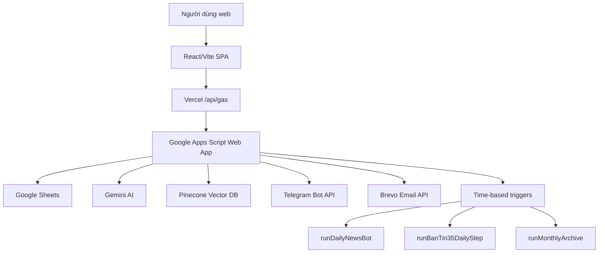

# 01-architecture.md - Kiến trúc hệ thống

## Tech Stack & Các thành phần chính

Hệ thống được thiết kế theo mô hình bán tập trung với các lớp công nghệ nhẹ để tối ưu hóa chi phí vận hành và tính linh hoạt.

### 1. Frontend (Thư mục `web/`)
- **Framework**: React 18, Vite 6.
- **Styling**: Vanilla CSS cho tính linh hoạt và tối ưu hiệu năng.
- **Hosting**: Triển khai Single Page Application (SPA) trên Vercel.
- **Serverless API Proxy**: API route `/web/api/gas.js` trên Vercel đóng vai trò:
  - Che giấu `API_ACCESS_TOKEN` giao tiếp với Apps Script.
  - Thực hiện băm IP client bằng `IP_HASH_SALT` bắt buộc trước khi chuyển tới Apps Script nhằm bảo vệ thông tin cá nhân.
  - Áp dụng các quy tắc bảo mật và hạn chế truy cập trực tiếp.
  - Production frontend luôn gọi `/api/gas`; môi trường dev chỉ trỏ thẳng Apps Script khi cấu hình `VITE_GAS_URL` (không phải secret). Không dùng `VITE_API_TOKEN` vì biến `VITE_*` bị đóng gói vào bundle.
  - Rate limit tại proxy chỉ là best-effort trên Vercel serverless; các endpoint tốn chi phí phải có quota/guard thật ở Apps Script.

#### Policy endpoint qua proxy

| Nhóm | Action | Ghi chú |
| --- | --- | --- |
| Public GET | `today`, `articles`, `search`, `quiz`, `books`, `book`, `stats` | Không inject token; dữ liệu công khai/không tốn chi phí AI trực tiếp. |
| Token POST | `subscribe`, `submit_quiz`, `contact` | Proxy inject `GAS_API_TOKEN`/`API_ACCESS_TOKEN`; GAS gọi `validateApiToken_`. |
| Admin | `feedback_stats`, `video_export`, `bantin35_generate`, `bantin35_setup_trigger`, `bantin35_trigger_status` | Proxy yêu cầu `ADMIN_API_TOKEN` từ client vận hành, sau đó inject token GAS. |
| Public POST có guard nghiệp vụ | `troly35_run`, `troly35_rate`, `troly35_feedback`, `troly35_history`, `troly35_trends`, `bantin35_latest` | Không dùng token proxy; dựa vào accessCode/quota/logic backend tương ứng. |
| Tạm tắt | `ask_book` | Backend trả lỗi hướng dẫn dùng NotebookLM; chỉ bật lại sau khi có quota riêng. |

### 2. Backend (Thư mục `backend/`)
- **Nền tảng**: Google Apps Script (GAS) runtime V8.
- **Cơ chế triển khai**: Deploy bằng công cụ `@google/clasp` của Google.
- **Chức năng**:
  - Nhận và điều phối API request từ proxy.
  - Thực thi quy trình thu thập tin tức (RSS/HTML scraper), xử lý dữ liệu thô và gọi Gemini AI để tóm tắt, gắn nhãn.
  - Thực thi quy trình scrape Tạp chí Cộng sản (TCCS), tách đoạn (chunking), phê duyệt và đồng bộ vector lên Pinecone.
  - Điều khiển gửi email qua Brevo API và gửi tin Telegram Bot API.

### 3. Cơ sở dữ liệu (Database)
- **Nền tảng**: Google Sheets.
- **Lý do lựa chọn**: Chi phí $0, giao diện trực quan giúp cán bộ nghiệp vụ dễ dàng chỉnh sửa dữ liệu, duyệt bài RAG hoặc thay đổi bộ câu hỏi Quiz mà không cần biết kỹ thuật.
- **Các bảng (sheets) chính**:
  - `TIN_TUC`: Lưu trữ tin tức chính thống đã tóm tắt.
  - `TROLY35_HISTORY` & `TROLY35_FEEDBACK`: Nhật ký chat và đánh giá chất lượng chatbot.
  - `TCCS_ARTICLES` & `TCCS_CHUNKS`: Kho dữ liệu thô và các mảnh tri thức phục vụ RAG.
  - `PHAN_BAC_KHO`: Kho dữ liệu tri thức phản bác đã chuẩn hóa.
  - `QUIZ` & `QUIZ_RESULT`: Bộ câu hỏi trắc nghiệm chính trị và kết quả người thi.
  - `BANTIN35_ITEMS` & `BANTIN35_REPORTS`: Dữ liệu phục vụ Bản tin 35 nội bộ gửi Telegram.
  - `TU_SACH`: Danh mục Tủ sách số gồm metadata sách/tài liệu, tóm tắt, podcast gợi ý, sơ đồ tư duy, NotebookLM URL và nguồn chính thống.

### 4. AI & Vector Database
- **LLM**: Gemini API (mặc định sử dụng model `gemini-2.5-flash` cho hiệu năng cao và chi phí thấp).
- **Embeddings**: Gemini embedding model (`gemini-embedding-2`), xuất kích thước 768 chiều.
- **Vector DB**: Pinecone index (Dense vector, metric `cosine`) dùng để lưu trữ và truy vấn tương đồng (RAG) kho bài viết TCCS và dữ liệu phản bác.

### 5. Module Video (Thư mục `video_module/`)
- **Công nghệ**: Python + FFmpeg.
- **Chức năng**: Biên tập và kết xuất video tự động từ kịch bản AI, chèn nhạc nền có cơ chế tự động giảm âm lượng khi có giọng nói (ducking), tạo hiệu ứng karaoke cho phụ đề và xuất bản short dọc.

## Luồng xử lý chính (Trợ lý 35)
1. Người dùng gửi câu hỏi từ giao diện React kèm mã truy cập (`accessCode`), chế độ (`mode`), và tùy chọn phong cách (`style`), lịch sử cuộc hội thoại (`history`).
2. Vercel proxy mã hóa IP của người dùng và chuyển tiếp yêu cầu cùng mã token xác thực đến GAS.
3. GAS xác thực token và kiểm tra lượt giới hạn sử dụng trong ngày (quota limit).
4. Nếu cuộc hội thoại là lượt tiếp theo (follow-up):
   - GAS neo câu gốc đầu tiên của cuộc hội thoại để thực hiện trích xuất từ khóa và RAG trên Pinecone.
   - Trực tiếp chuyển câu hỏi mới cùng ngữ cảnh lịch sử làm yêu cầu tinh chỉnh cho Gemini.
5. Nếu cuộc hội thoại là lượt đầu tiên:
   - GAS phân tích nội dung câu hỏi, tạo embedding và tìm kiếm các tri thức phản bác tương đồng trên Pinecone.
6. Gemini kết hợp dữ liệu câu hỏi, lịch sử hội thoại (nếu có) và tri thức RAG để sinh ra câu trả lời theo đúng phong cách được chỉ định (`chinhluan`, `tretrung`, `ngangon`).
7. GAS ghi nhận lịch sử vào sheet `TROLY35_HISTORY` và trả kết quả về cho frontend.

## Luồng xử lý Tủ sách số
1. Người dùng mở tab bottom nav `Học tập`, sau đó chọn mục con `Tủ sách` cùng nhóm với Video, Infographic và Kiểm tra.
2. Frontend gọi Apps Script action `books` để lấy danh mục từ sheet `TU_SACH`; action `book` lấy chi tiết từng cuốn theo `id`.
3. Người dùng tra cứu metadata/tóm tắt/sơ đồ tư duy/nguồn và mở link NotebookLM chung của tủ sách để hỏi đáp chuyên sâu. Khi dùng NotebookLM, người vận hành chọn/tích nguồn tài liệu cần xem trong cùng một notebook.

> **Trạng thái (2026-06-09): Hỏi đáp AI trực tiếp trong Tủ sách đang TẠM TẮT.**
> - Frontend đã gỡ form "Hỏi AI"; chỉ còn nút mở NotebookLM theo từng cuốn.
> - Backend: action `ask_book` trả về thông báo "đang tạm tắt" và **không** gọi Gemini nữa. Hàm `askBookAI` trong `08-tusach.gs` vẫn giữ nguyên để bật lại khi cần.
> - Lý do: chưa có quota/phân quyền riêng cho `ask_book` (xem review kiến trúc 2026-06-09); tránh rủi ro đốt chi phí Gemini qua endpoint public.
> - Khi bật lại: khôi phục `case 'ask_book'` trong `07-main.gs` (gọi `askBookAI` + `validateInput_`) và khôi phục UI hỏi đáp trong `TuSach.jsx`; nên bổ sung quota trước khi mở lại.

## Luồng xử lý NotebookLM trong Tủ sách
1. NotebookLM không còn là tab bottom nav riêng. Điểm vào được gộp vào mục con `Tủ sách` trong tab `Học tập` để tránh trùng nội dung catalog tài liệu.
2. Frontend dùng cùng dữ liệu action `books`/`book` từ sheet `TU_SACH`; trường `NotebookLM URL` hiện dùng chung một link NotebookLM cho toàn bộ tủ sách.
3. Người dùng mở NotebookLM từ chi tiết tài liệu trong `Tủ sách`, sau đó chọn nguồn tài liệu cần hỏi đáp trong NotebookLM.
4. Luồng NotebookLM không gọi Gemini, không ghi dữ liệu mới và không thay đổi contract API hiện tại.
