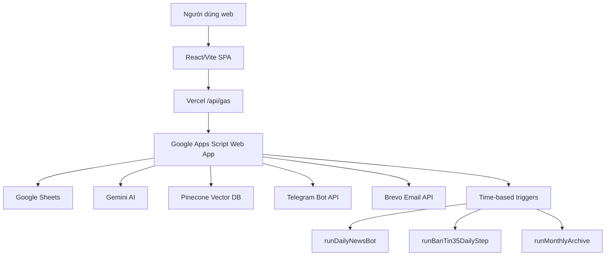

# 01-architecture.md - Kiến trúc hệ thống

## Chọn kỳ duyệt qua cấu hình (02/10/2026)

- `duyetKyThuTuan` đọc riêng `THU_TUAN_APPROVAL_WEEK` và truyền nguyên giá trị cho API duyệt. Chỉ null (key vắng) mới dùng tuần hiện tại; giá trị rỗng/sai vẫn bị core từ chối. Key không tham gia config sender/trigger, không chọn tuần gửi.
- Luồng approval explicit-week, identity/HMAC/lock/readback và sender giữ nguyên. Reviewer có thể duyệt kỳ tương lai trước lịch thật mà không chỉnh source cloud. Xóa key sau duyệt để lần chạy tay kế tiếp trở lại tuần hiện tại.

## Duyệt kỳ hiện tại từ Apps Script editor (02/10/2026)

- Entry point thủ công `duyetKyThuTuan` chọn thứ Hai hiện tại qua `thuTuanWeekKey_(new Date())` theo Asia/Ho_Chi_Minh rồi gọi `duyetNoiDungThuTuan`; không cần sửa source để truyền ngày trong editor.
- Implementation identity/allow-list, completeness, ScriptLock, HMAC và readback không đổi. API có tham số vẫn cho reviewer chọn kỳ rõ ràng. Không gửi hoặc tạo trigger/schema/route mới.

## Chuẩn bị pilot Production Thư tuần Zalo (01/10/2026)

- `ZaloDiagnostics.gs`: core receiver dùng chung `thuTuanZaloDiagnosticConfigFor_(env)`/`thuTuanZaloDiagnosticRun_(event,receive,env)`. Env do entrypoint cố định: `nhanSuKienZaloThuTuanTest`→TEST, `nhanSuKienZaloThuTuanProd`→PROD; `THU_TUAN_ZALO_ENV` chỉ phải khớp. PROD yêu cầu ENABLED=false, TEST_MODE=false, ZALO, ENV=PROD, pin script/hai Sheet/Bot PROD, không trùng project/Bot/Sheet TEST. Chẩn đoán host đọc (`chanDoanZaloThuTuan`) và helper scope vẫn TEST-only.
- Marker theo domain môi trường `THU_TUAN_ZALO_<ENV>_CHALLENGE`; pin chỉ ghi cặp `<ENV>_CHAT_ID/CHAT_SHA256`. Nếu `<ENV>_GROUP_CONFIRMED` tồn tại (bất kỳ giá trị) thì từ chối trước mọi API call và recheck ngay trước ghi. Thứ tự vận hành: xóa xác nhận → pin → con người kiểm tra → GROUP_CONFIRMED=true.
- `ZaloTransport.gs` thêm `kiemTraSanSangZaloProduction()` chỉ đọc: kiểm property/pin, `thuTuanZaloConfig_`, getMe qua `thuTuanZaloPreflight_`, preview qua `thuTuanExecute_(true)` (core tự lock), quét SENDING/UNKNOWN/trạng thái lạ toàn lịch sử hai log, đếm trigger của tài khoản chạy. Trả `READY_FOR_PRODUCTION_PILOT` hoặc `NOT_READY` + mã ngắn; không ID/token/hash/nội dung.
- `Code.gs`: `guiThuTuan(event)` qua `thuTuanTriggerResult_`; chạy từ trigger mà status khác COMPLETE/DISABLED thì throw `THU_TUAN_TRIGGER_ATTENTION:<STATUS>` sau khi runner đã log và nhả lock. Chạy tay không đổi.
- CI `.github/workflows/thu-tuan.yml`: PR/push `main`, Node 22, parse mọi `.gs` bằng `vm.Script`, chạy hai file test Thư tuần. Không thay đổi schema Sheets, renderer, kiến trúc Gmail hoặc API frontend/backend.

## Sau review PR #12 — state gửi và cấu hình (01/10/2026)

- Core runner giữ tiến độ Zalo tại boundary: sent là SENT đã ghi bền vững, attempted là lần gọi send, confirmed là receipt hợp lệ trong lượt hiện tại. Lỗi loop I/O không mất số phần trước; lỗi sau send vẫn giữ đối soát. Gmail giữ behavior cũ, không API/schema mới.
- Sau flush SENDING, guard chưa gọi API thất bại thì ghi FAILED/PRE_SEND_BLOCKED và dừng. FAILED chỉ cho biết phần đó chưa được lượt này gửi; nếu write không xác nhận thì giữ SENDING và yêu cầu đối soát. UNKNOWN không auto retry. Prefix log từ chối phần PENDING/FAILED trước phần SENT.
- Config whitelist pin hai profile và credential của profile hoạt động; Gmail không giữ Zalo credentials; approval secret vẫn riêng ở core HMAC. Acceptance so sánh strict mọi key/value của snapshot cấu hình có ý nghĩa, không snapshot toàn bộ Properties/seal/unrelated secrets. Recheck nội dung/cấu hình trước và sau flush vẫn giữ để chặn race.
- Manual acceptance SEND có kill switch TEST trong finally kể cả BUSY/guard/adapter hỏng: độc lập xác minh actual Script ID/pin TEST/no PROD collision và raw TEST flags trước property write/readback. Không sở hữu lock khi BUSY, không ghi log hoặc release lock lượt khác; request đang chạy được ghi receipt/state rồi dừng ở guard kế tiếp. Unverified identity/write failure báo DISABLE_UNCONFIRMED và giữ operationStatus/counters.
- Diagnostic marker mới mỗi phiên bằng UUID/HMAC domain riêng, chỉ public challenge ở READY, không nonce/secret; parser/pin dùng marker tham số cùng cửa sổ. Bot ID pin là identity, không hardcode tên. Counterpart Gmail log optional nhưng schema hiện hữu vẫn kiểm.
- Helper fixed-week chỉ thuộc lần TEST acceptance lịch sử, không bộ cài Production. Bản sửa PR #12 đã lưu lên GAS TEST và chạy lại preview/đối soát chỉ đọc đạt; lần gửi thật vẫn thuộc source trước patch, nhánh lỗi mới chỉ kiểm local.

## Cập nhật 01/10/2026 — Chẩn đoán nhận event TEST

- Guard gửi Zalo không đổi: vẫn cần chat ID từ event GROUP đã xác minh, SHA-256 và membership confirmation trước preview/getMe chính thức/gửi. TEST-only không cần profile PROD chưa tồn tại.
- Chẩn đoán thủ công TEST được tách khỏi transport: xác minh script, hai Sheet và Bot pin, yêu cầu ENABLED=false/TEST_MODE=true/ZALO/ENV=TEST, Script Lock và chỉ API đọc. Không receiver thường trực, webhook, trigger hoặc đường gửi mới. Không xuất token, secret, chat ID, raw event/error hoặc webhook URL.
- Initial `chanDoanZaloThuTuan` chỉ đọc. Receiver ghép cặp với một marker owner trong GROUP đúng cửa sổ có thể lưu riêng TEST_CHAT_ID/SHA256, từ chối pin khác, xác minh readback; không đặt GROUP_CONFIRMED. Membership vẫn phải do owner xác nhận trước preview/preflight/gửi.
- `capQuyenZaloThuTuanTest` là entrypoint thủ công TEST bị tắt để yêu cầu riêng external_request đã khai báo; native Google consent không bị catch/suppressed. Không revoke, API call, auth URL hoặc cấu hình gửi. Phase/category lỗi cố định giúp phân biệt FETCH authorization, HTTP response và JSON/API mà không xuất raw errors.
- Hai endpoint tài liệu/SDK phải được so sánh bằng evidence chỉ đọc trước kết luận; không thay host transport từ giả thuyết. getUpdates trả result object, timeout là chuỗi; chỉ một consumer trong phiên nhận có giới hạn và phối hợp thời điểm với owner.
- Các trạng thái cloud/local 30/9 bên dưới là lịch sử. Chỉ đạo owner giữ hai secret TEST tới khi test thành công thay thế yêu cầu rotation trước điều tra; Production giữ nguyên.
- Fixture TEST dùng helper riêng `ZaloAcceptance.gs`, cố định source2026-09-28/fixture2026-10-05, full pin target/membership trước mọi thao tác. Core `thuTuanRun_` không đổi guard transport/state; không chuyển kỳ của luồng gửi thường trực. Tạo clone Nhap, duyệt bằng implementation chung `thuTuanApproveContent_` với verifier trong cùng lock, preview seal bind config/target/approval/plan, gửi rồi tắt/readback ENABLED=false, audit receipt chỉ đọc. Public `duyetNoiDungThuTuan` vẫn dùng implementation đó với behavior cũ, không verifier bổ sung. Không schema/trigger/API public mới, không deploy webapp.
- Snapshot guard của helper so sánh đệ quy mọi own-key và giá trị chính xác; object enumeration order của PropertiesService không ảnh hưởng kết quả. Array giữ thứ tự/độ dài, secret/pin không bỏ hoặc chuẩn hóa. Phase/reason chỉ dùng mã allowlist, không native error. Thay đổi giới hạn acceptance helper, không đổi guard/state machine gửi.

## Cập nhật 30/9/2026 — Transport Thư tuần Gmail/Zalo

- Service vẫn là project Apps Script độc lập tại `services/thu-tuan`, không nằm trong backend Web App. `THU_TUAN_TRANSPORT` mặc định GMAIL; ZALO dùng `ZaloTransport.gs` và UrlFetchApp trực tiếp. Không webhook, Vercel hay retry/fallback tự động.
- `Code.gs` giữ renderer canonical, approval/HMAC, adapter storage Sheets dùng chung, LockService và state machine. Gmail dùng MailApp và nhật ký 9 cột hiện có. Zalo dùng cùng plain text, chia tối đa 3 phần ≤1800 đơn vị UTF-16, giữ nguyên chuỗi khi nối, bảo vệ Unicode/emoji; mỗi phần có identity và receipt riêng.
- Bảng hạn chế bổ sung `ThuTuan_Zalo_NhatKyGui`: `Khoa, Ky, MaCB, MaLoiDay, PhienBan, DauVanBanDuyet, TrangThai, CapNhatLuc, MaLoi, Transport, Environment, TargetHash, Part, PartCount, PlanHash, MessageId`. Không migrate schema Gmail. Hai log được đối chiếu để chặn đổi transport trong kỳ đã có lịch sử.
- Trước gửi: khóa script, xác minh approval, kế hoạch phần, log và preflight getMe đúng Bot/can_join_groups. Đọc lại cấu hình/nội dung trước từng phần và sau flush SENDING; HTTP 2xx + ok boolean true + message_id hợp lệ mới SENT. Mọi kết quả gửi/ghi log không chắc chắn UNKNOWN (hoặc SENDING nếu không ghi được UNKNOWN), dừng để reconciliation thủ công. Preview không gọi mạng/ghi log.
- TEST/PROD pin riêng script ID, Bot ID, hash chat và hai bảng tính. Mỗi deployment chỉ cần đủ pin của profile đang hoạt động; profile đối diện có thể chưa tồn tại, nhưng nếu khai báo một phần thì fail closed, và nếu khai báo đủ thì các identity/Sheet ID phải khác nhau. TEST project không thể đổi sang PROD bằng Script Properties vì `ScriptApp.getScriptId()` không khớp pin PROD. Chỉ môi trường hoạt động cần token/chat_id/GROUP_CONFIRMED. TEST_MODE phải khớp ENV, TEST không trigger. Có capability getMe không thay xác nhận thủ công Bot đã vào đúng nhóm; tài liệu group hiện vẫn ghi thử nghiệm nội bộ.
- Manifest thêm external_request; exceptionLogging vẫn NONE. Không lưu token/chat_id/nội dung lỗi hoặc URL token trong log. Cấu hình Gmail hiện có không cần thuộc tính/sheet Zalo để tiếp tục sử dụng.
- CodeGraph đã xác định đường gọi `thuTuanExecute_ → thuTuanRun_`, các hàm approval/render/log và routes chỉ ở service riêng; API frontend/backend không bị đổi. Runbook và bảng properties: `services/thu-tuan/README.md`, mục 12.
- Runtime TEST chưa triển khai/nghiệm thu Zalo: project TEST đang tắt, chưa có thuộc tính Bot/chat/pin. Production chưa thay đổi. Local 82 test thành công, frontend build thành công; regression Python chưa chạy do thiếu pytest.

## Tech Stack & Các thành phần chính

Hệ thống được thiết kế theo mô hình bán tập trung với các lớp công nghệ nhẹ để tối ưu hóa chi phí vận hành và tính linh hoạt.

```mermaid
flowchart TD
  User[Người dùng web] --> Web[React/Vite SPA]
  Web --> Proxy[Vercel /api/gas]
  Proxy --> GAS[Google Apps Script Web App]
  GAS --> Sheets[Google Sheets]
  GAS --> Gemini[Gemini AI]
  GAS --> Pinecone[Pinecone Vector DB]
  GAS --> Telegram[Telegram Bot API]
  GAS --> Brevo[Brevo Email API]

  GAS --> Trigger[Time-based triggers]
  Trigger --> News[runDailyNewsBot]
  Trigger --> BanTin35[runBanTin35DailyStep]
  Trigger --> Archive[runMonthlyArchive]
```

### 1. Frontend (Thư mục `web/`)
- **Framework**: React 18, Vite 6.
- **Styling**: Vanilla CSS cho tính linh hoạt và tối ưu hiệu năng.
- **Hosting**: Triển khai Single Page Application (SPA) trên Vercel.
- **Serverless API Proxy**: API route `/web/api/gas.js` trên Vercel đóng vai trò:
  - Che giấu `API_ACCESS_TOKEN` giao tiếp với Apps Script.
  - Thực hiện băm IP client bằng `IP_HASH_SALT` bắt buộc trước khi chuyển tới Apps Script nhằm bảo vệ thông tin cá nhân.
  - Áp dụng các quy tắc bảo mật và hạn chế truy cập trực tiếp.
  - Production frontend luôn gọi `/api/gas`; môi trường dev chỉ trỏ thẳng Apps Script khi cấu hình `VITE_GAS_URL` (không phải secret). Không dùng `VITE_API_TOKEN` vì biến `VITE_*` bị đóng gói vào bundle.
  - Rate limit tại proxy chỉ là best-effort trên Vercel serverless; các endpoint tốn chi phí phải có quota/guard thật ở Apps Script.

#### Policy endpoint qua proxy

| Nhóm | Action | Ghi chú |
| --- | --- | --- |
| Public GET | `today`, `articles`, `search`, `quiz`, `books`, `book`, `stats` | Không inject token; dữ liệu công khai/không tốn chi phí AI trực tiếp. |
| Token POST | `subscribe`, `submit_quiz`, `contact` | Proxy inject `GAS_API_TOKEN`/`API_ACCESS_TOKEN`; GAS gọi `validateApiToken_`. |
| Admin | `feedback_stats`, `video_export`, `bantin35_generate`, `bantin35_setup_trigger`, `bantin35_trigger_status` | Proxy yêu cầu `ADMIN_API_TOKEN` từ client vận hành, sau đó inject token GAS. |
| Public POST có guard nghiệp vụ | `troly35_run`, `troly35_rate`, `troly35_feedback`, `troly35_history`, `troly35_trends`, `bantin35_latest` | Không dùng token proxy; dựa vào accessCode/quota/logic backend tương ứng. |
| Tạm tắt | `ask_book` | Backend trả lỗi hướng dẫn dùng NotebookLM; chỉ bật lại sau khi có quota riêng. |

### 2. Backend (Thư mục `backend/`)
- **Nền tảng**: Google Apps Script (GAS) runtime V8.
- **Cơ chế triển khai**: Deploy bằng công cụ `@google/clasp` của Google.
- **Chức năng**:
  - Nhận và điều phối API request từ proxy.
  - Thực thi quy trình thu thập tin tức (RSS/HTML scraper), xử lý dữ liệu thô và gọi Gemini AI để tóm tắt, gắn nhãn.
  - Thực thi quy trình scrape Tạp chí Cộng sản (TCCS), tách đoạn (chunking), phê duyệt và đồng bộ vector lên Pinecone.
  - Điều khiển gửi email qua Brevo API và gửi tin Telegram Bot API.

### 3. Cơ sở dữ liệu (Database)
- **Nền tảng**: Google Sheets.
- **Lý do lựa chọn**: Chi phí $0, giao diện trực quan giúp cán bộ nghiệp vụ dễ dàng chỉnh sửa dữ liệu, duyệt bài RAG hoặc thay đổi bộ câu hỏi Quiz mà không cần biết kỹ thuật.
- **Các bảng (sheets) chính**:
  - `TIN_TUC`: Lưu trữ tin tức chính thống đã tóm tắt.
  - `TROLY35_HISTORY` & `TROLY35_FEEDBACK`: Nhật ký chat và đánh giá chất lượng chatbot.
  - `TCCS_ARTICLES` & `TCCS_CHUNKS`: Kho dữ liệu thô và các mảnh tri thức phục vụ RAG.
  - `PHAN_BAC_KHO`: Kho dữ liệu tri thức phản bác đã chuẩn hóa.
  - `QUIZ` & `QUIZ_RESULT`: Bộ câu hỏi trắc nghiệm chính trị và kết quả người thi.
  - `BANTIN35_ITEMS` & `BANTIN35_REPORTS`: Dữ liệu phục vụ Bản tin 35 nội bộ gửi Telegram.
  - `TU_SACH`: Danh mục Tủ sách số gồm metadata sách/tài liệu, tóm tắt, podcast gợi ý, sơ đồ tư duy, NotebookLM URL và nguồn chính thống.

### 4. AI & Vector Database
- **LLM**: Gemini API (mặc định sử dụng model `gemini-2.5-flash` cho hiệu năng cao và chi phí thấp).
- **Embeddings**: Gemini embedding model (`gemini-embedding-2`), xuất kích thước 768 chiều.
- **Vector DB**: Pinecone index (Dense vector, metric `cosine`) dùng để lưu trữ và truy vấn tương đồng (RAG) kho bài viết TCCS và dữ liệu phản bác.

### 5. Module Video (Thư mục `video_module/`)
- **Công nghệ**: Python + FFmpeg.
- **Chức năng**: Biên tập và kết xuất video tự động từ kịch bản AI, chèn nhạc nền có cơ chế tự động giảm âm lượng khi có giọng nói (ducking), tạo hiệu ứng karaoke cho phụ đề và xuất bản short dọc.

## Luồng xử lý chính (Trợ lý 35)
1. Người dùng gửi câu hỏi từ giao diện React kèm mã truy cập (`accessCode`), chế độ (`mode`), và tùy chọn phong cách (`style`), lịch sử cuộc hội thoại (`history`).
2. Vercel proxy mã hóa IP của người dùng và chuyển tiếp yêu cầu cùng mã token xác thực đến GAS.
3. GAS xác thực token và kiểm tra lượt giới hạn sử dụng trong ngày (quota limit).
4. Nếu cuộc hội thoại là lượt tiếp theo (follow-up):
   - GAS neo câu gốc đầu tiên của cuộc hội thoại để thực hiện trích xuất từ khóa và RAG trên Pinecone.
   - Trực tiếp chuyển câu hỏi mới cùng ngữ cảnh lịch sử làm yêu cầu tinh chỉnh cho Gemini.
5. Nếu cuộc hội thoại là lượt đầu tiên:
   - GAS phân tích nội dung câu hỏi, tạo embedding và tìm kiếm các tri thức phản bác tương đồng trên Pinecone.
6. Gemini kết hợp dữ liệu câu hỏi, lịch sử hội thoại (nếu có) và tri thức RAG để sinh ra câu trả lời theo đúng phong cách được chỉ định (`chinhluan`, `tretrung`, `ngangon`).
7. GAS ghi nhận lịch sử vào sheet `TROLY35_HISTORY` và trả kết quả về cho frontend.

## Luồng xử lý Tủ sách số
1. Người dùng mở tab bottom nav `Học tập`, sau đó chọn mục con `Tủ sách` cùng nhóm với Video, Infographic và Kiểm tra.
2. Frontend gọi Apps Script action `books` để lấy danh mục từ sheet `TU_SACH`; action `book` lấy chi tiết từng cuốn theo `id`.
3. Người dùng tra cứu metadata/tóm tắt/sơ đồ tư duy/nguồn và mở link NotebookLM chung của tủ sách để hỏi đáp chuyên sâu. Khi dùng NotebookLM, người vận hành chọn/tích nguồn tài liệu cần xem trong cùng một notebook.

> **Trạng thái (2026-06-09): Hỏi đáp AI trực tiếp trong Tủ sách đang TẠM TẮT.**
> - Frontend đã gỡ form "Hỏi AI"; chỉ còn nút mở NotebookLM theo từng cuốn.
> - Backend: action `ask_book` trả về thông báo "đang tạm tắt" và **không** gọi Gemini nữa. Hàm `askBookAI` trong `08-tusach.gs` vẫn giữ nguyên để bật lại khi cần.
> - Lý do: chưa có quota/phân quyền riêng cho `ask_book` (xem review kiến trúc 2026-06-09); tránh rủi ro đốt chi phí Gemini qua endpoint public.
> - Khi bật lại: khôi phục `case 'ask_book'` trong `07-main.gs` (gọi `askBookAI` + `validateInput_`) và khôi phục UI hỏi đáp trong `TuSach.jsx`; nên bổ sung quota trước khi mở lại.

## Luồng xử lý NotebookLM trong Tủ sách
1. NotebookLM không còn là tab bottom nav riêng. Điểm vào được gộp vào mục con `Tủ sách` trong tab `Học tập` để tránh trùng nội dung catalog tài liệu.
2. Frontend dùng cùng dữ liệu action `books`/`book` từ sheet `TU_SACH`; trường `NotebookLM URL` hiện dùng chung một link NotebookLM cho toàn bộ tủ sách.
3. Người dùng mở NotebookLM từ chi tiết tài liệu trong `Tủ sách`, sau đó chọn nguồn tài liệu cần hỏi đáp trong NotebookLM.
4. Luồng NotebookLM không gọi Gemini, không ghi dữ liệu mới và không thay đổi contract API hiện tại.

## Luồng xử lý Thư tuần “Lời Bác dạy”

- services/thu-tuan/ là Apps Script project độc lập, không có doGet/doPost và không được chép vào backend Web App public. Project dùng một bảng nội dung và một bảng riêng tư cho recipient cùng nhật ký gửi.
- Luồng gửi: trigger thứ Hai hoặc chạy thủ công → Script Lock → xác minh approval HMAC-SHA256 canonical version 2 và allow-list người duyệt → kiểm tra toàn bộ recipient table → ghi SENDING → gửi riêng từng email qua MailApp → ghi SENT hoặc giữ trạng thái cần reconciliation.
- Canonical content chỉ gồm các trường được duyệt; hai cột legacy GoiYLienHe và LienHeAnNinhDoiNgoai không thuộc dấu HMAC v2 và không được render. Thư có HTML responsive, plain-text fallback và banner JPEG inline qua CID; lỗi tạo banner không chặn email.
- TEST mode dùng một recipient override, chỉ chạy thủ công và chặn tạo trigger. Production configuration/runtime chưa được xác minh; không xem kết quả kiểm thử cục bộ hoặc TEST là nghiệm thu Production.

### Công cụ Card Studio B/C offline (2026-10-03)

- services/thu-tuan/tools/card-studio/build.cjs + template.html đóng gói mẫu B/C thành HTML tự chứa từ JSON/portrait cục bộ ngoài Git. Không dependency mới; renderer dùng Canvas và ZIP native.
- Luồng riêng: kiểm trường/ngày/nguồn/caption → allowlist dữ liệu và mã hóa JSON → HTML riêng tư ngoài Git → xem PNG/kiểm fit → tải ZIP PNG/caption/manifest SHA256. Trạng thái luôn DRAFT_NOT_APPROVED.
- Template chỉ có B/C, theme căn giữa bằng actualBoundingBox, tên mô hình một dòng và motto in hoa lớn; auto-fit giữ đủ quote/source. Không có caller từ runtime GAS, không route/API/Sheet schema mới. Mẫu mới vẫn chờ phản hồi trước thay cả bộ ảnh.

### Card Studio D/F (2026-10-03)

- Template thay B/C bằng hai mẫu chốt: D (1600 × 1200, chủ đề căn trái cạnh chân dung) và F (1080 × 1350 cho điện thoại). Mỗi kỳ xuất cả hai PNG, một caption và một manifest version 2.
- Nền trống đồng là asset công khai services/thu-tuan/tools/card-studio/assets/trong-dong.webp; builder kiểm signature WebP, nhúng data URL và drumSha256. Trình duyệt tách hoa văn thành mặt nạ alpha rồi tô màu; không tải tài nguyên ngoài.
- Không đổi luồng GAS/route/API/Sheet; vẫn là công cụ offline, trạng thái DRAFT_NOT_APPROVED.

### Zalo Showcase V1, adapter tương tác TEST (2026-10-04)

- Luồng riêng: Zalo official webhook → `web/api/zalo-webhook.js` ở Vercel Preview xác thực header secret → HMAC envelope → backend TEST `/exec/zalo-showcase-v1` → `13-zalo-bot.gs` allowlist/dedupe/command router → Zalo sendMessage. GAS không nhận được header webhook qua documented event fields nên không xác thực Zalo trực tiếp.
- `doPost` yêu cầu path + action rõ ràng, chặn direct/mixed webhook; Telegram và POST API có regression. Không dùng `/api/gas`, Gemini, subscriber/history/quota AI hay bảng người nhận Thư tuần.
- Sáu lệnh deterministic; current-week/approval/canonical/split từ source service qua generated `13a-thu-tuan-read-core.gs`, CI chống drift. Quiz tái sử dụng `quizFromRows_`, chỉ câu hỏi ID được phép; CacheService 5 phút, không lưu kết quả cá nhân.
- ScriptLock và hashed Script Properties tombstone 24 giờ giữ claim/SENDING/SENT/UNKNOWN, không tự resend khi kết quả chưa rõ; rate guard best effort. Config pin project/Bot/group/workbooks TEST, production deployment relay bị chặn. Không thêm trigger/schema.
- Card F vẫn BLOCKED_PRIVATE_MEDIA vì URL-only sendPhoto và manifest draft; text không phụ thuộc ảnh. Runtime mới chưa chạy; xem `docs/ZALO_SHOWCASE_V1.md` cho cấu hình và gate nghiệm thu.
