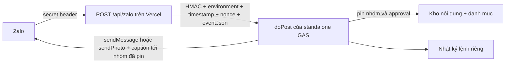

# Lệnh Bot Zalo cho dự án học tập lời Bác

Trạng thái05/10/2026: owner chỉ đạo dùng nhóm TEST thành Production; giữ Bot/GROUP/webhook URL hiện có, đổi profile sang PROD, TEST_MODE=false, relay ZALO_COMMAND_ENV=PROD. Catalog ký lại trong môi trường PROD; TEST history được giữ nguyên trong các tab archive. Thư tuần tự động nay dùng cùng ảnh D và full caption v3 như `/tuan`, receipt weekly tách riêng receipt lệnh. Bài12/10 LD047 đã duyệt và xác minh PNG/hash/caption1023,50 bài còn Nhap cần duyệt đúng kỳ. Giới hạn TEST-only và trạng thái cũ dưới đây là lịch sử.

Trạng thái cập nhật 04/10/2026 23:35: TEST Web App version3, hai command flags=true; `/tuan` đã gửi ảnh D + toàn bộ thư trong một tin. Owner cấp riêng quyền công khai51 ảnhD/viewer; catalog224 mục (173 cũ +51ANHTUAN) đã đọc lại/duyệt. Native preview `/tuan 2` xác minh PNG1.000.862bytes/hash đúng/caption1023UTF16. Một input kiểm soát qua relay gửi SENT13,019s; replay ALREADY_HANDLED2,151s, không tin trùng. Native webhook healthy/logRows12, toàn SENT/receipt/target hợp lệ/no unresolved. Regression201/201 +33/33 actualcloudcompat +syntax22GAS đạt. Owner đã thử mention `/tuan 2` từ Zalo và xác nhận ảnh/thư hiển thị đúng; callback23:37:59 ROOT→SENT/HTTP200 được đối chiếu. Bot token/khóa duyệt/Properties cũ và lịch tuần giữ nguyên. Lỗi callback root-level trước đây đã sửa ở relay.

## Lệnh dành cho người dùng

| Lệnh | Nội dung |
| --- | --- |
| `/gioithieu` hoặc `/start` | Giới thiệu mô hình, mục đích và cách dùng Bot. |
| `/trogiup` hoặc `/help` | Hướng dẫn và ví dụ. |
| `/tracuu <từ khóa hoặc mã>` | Tìm thông tin mô hình và lời dạy đã duyệt; không dấu được hỗ trợ. |
| `/tuan [số tuần hoặc YYYY-MM-DD]` | Ảnh ngang D kèm toàn bộ thư tuần đã duyệt trong một tin; bỏ trống chọn tuần hiện tại Việt Nam. Tuần chưa có ảnh được duyệt trả toàn bộ thư bằng chữ. |
| `/lich [trang]` | Lịch học tập, 10 tuần/trang. Lịch không phải dấu duyệt nội dung. |
| `/tailieu [từ khóa hoặc mã]` | Tối đa 5 tài liệu phù hợp; liên kết phải được phép chia sẻ, nếu chưa có thì hướng dẫn liên hệ người phụ trách. |
| `/khoanh [mã LD]` | Liên kết kho hoặc hai ảnh D/F của một mã. Giữ quyền Drive. |

Ví dụ: `/tracuu khau hieu`, `/tracuu LD-047`, `/tuan 2`, `/tuan 2026-10-12`, `/lich 3`, `/tailieu ke hoach`, `/khoanh LD-047`. Có thể gõ `giới thiệu`, `tra cứu bản lĩnh`, `tài liệu`; tin trò chuyện thông thường không được trả lời. Prefix mention như `@Bot Tên /trogiup` được nhận diện; cú pháp mention thực tế phải kiểm trên nhóm.

Một lệnh trả tối đa một tin 1.800 đơn vị UTF-16. `/tuan` dùng sendPhoto với toàn bộ thư làm caption: tiêu đề/ngày, lời dạy/nguồn, bối cảnh, ý nghĩa và vận dụng, hành động tuần này. Dùng renderer đang chạy trên cloud, không tóm tắt tại thời điểm gửi. Không cắt nguyên văn hoặc nguồn: bản quá dài/chưa có nội dung Zalo hợp lệ trả hướng dẫn tra tài liệu. Kết quả tìm kiếm tối đa 3 thông tin + 3 lời dạy. Bot chỉ trả trong nhóm GROUP đã pin, không phục vụ chat PRIVATE hoặc nhóm khác. Không có lệnh duyệt, điều khiển lịch hay đọc dữ liệu người nhận; trả thư theo yêu cầu dùng nhật ký lệnh riêng, không gọi sender theo lịch.

## Luồng nhận tin và ranh giới triển khai

Theo tài liệu [Zalo webhook](https://bot.zapps.me/docs/webhook/), cần kiểm header `X-Bot-Api-Secret-Token`. [Event Web App được Google tài liệu hóa](https://developers.google.com/apps-script/guides/web#request_parameters) không có trường header tùy ý; relay Vercel hiện có xử lý bước xác thực này. Không truyền header giả vào event GAS và không dùng URL chứa token làm xác thực.

`web/api/zalo.js` không dùng token Trợ lý 35 hoặc credential Bot. Bản TEST được đóng gói riêng trên project Vercel `thu-tuan-zalo-test`, chỉ có handler này và cấu hình Node, không deploy toàn bộ website Trợ lý 35. Nó xác thực header và giới hạn body gốc 32 KiB, rồi chuẩn hóa root-level text callback thực tế sang canonical `{ok:true,result:{event_name,message}}` trước ký HMAC. Chỉ normalize khi không có result, message là object không array; explicit ok khác true bị chặn, wrapper cũ giữ nguyên. Hai dạng cùng environment/chat/message ID vẫn cùng khóa dedupe. GAS kiểm HMAC/freshness 60 giây, pin TEST/PROD, nhóm, người gửi không phải Bot và tuổi tin tối đa 5 phút trước khi xử lý. Không log raw event, câu hỏi, from/chat ID, token, dấu duyệt hoặc raw exception; metadata server-only chỉ event classes trong whitelist, booleans, inputShape và processor status trong whitelist. Response chỉ có status/count.

Đây là **ngoại lệ triển khai mới cần owner chấp thuận** đối với quy tắc sender “không deploy Web App”: standalone project sẽ có `doPost` nhưng chỉ nhận envelope đã ký. Không chép service vào `backend/`, không đổi router hoặc `/api/gas` của Trợ lý 35. Giữ Code.gs/ZaloTransport.gs hiện đang chạy đã được đối chiếu; checkout này có thể cũ hơn source cloud v3, vì vậy không đẩy cả thư mục lên cloud.

Zalo [khuyến nghị webhook cho Production](https://bot.zapps.me/docs/apis/getUpdates/). Bot hiện được dùng lại ở TEST/PROD: chỉ một webhook hoạt động cho Bot; không đăng ký TEST song song hoặc tự deleteWebhook/getUpdates. Luồng tuần không dùng polling nên không thay lịch gửi. Bản này xử lý đồng bộ, timeout relay 20 giây, không có hàng đợi nền. [testWebhook](https://bot.zapps.me/docs/apis/testWebhook/) yêu cầu phản hồi kịp thời; độ trễ GAS/Vercel và payload kiểm tra webhook phải được nghiệm thu thật trước khi bật lâu dài.

## Hai bảng bổ sung (không đổi bảng cũ)

`ThuTuan_TraCuu` trong bảng nội dung, đúng 5 cột:

`Loai | Ma | TieuDe | NoiDung | Nguon`

- `GIOITHIEU`: đúng một dòng giới thiệu mô hình.
- `THONGTIN`: FAQ theo mã, tên, nội dung và nguồn hồ sơ.
- `LICHTUAN`: Ma=`TUAN-01`, TieuDe=mã LD, NoiDung=ngày thứ Hai. Chỉ ánh xạ lịch; không sao chép lời dạy.
- `TAILIEU`: danh mục hoặc liên kết phát hành được phép; không sao chép toàn hồ sơ nội bộ.
- `KHOANH`: link xem Drive hiện có, không dùng link này để sendPhoto hoặc đổi quyền.
- `ANHTUAN`: Ma=`ANH-YYYY-MM-DD` (thứ Hai), TieuDe=mã LD, NoiDung=URL ảnh PNG trực tiếp `https://drive.google.com/uc?export=download&id=<file-id>`, Nguon=SHA-256 64 hex của ảnh D đã đối chiếu manifest. Các dòng này tham gia seal catalog như các mục khác. Không suy link ảnh gửi từ KHOANH. `/tuan` chọn đúng cả kỳ/mã, tải và kiểm MIME/signature/hash trước preflight và ngay trước sendPhoto. Ảnh HTML/khác hash bị chặn; không đổi quyền Drive. Không có ảnh hợp lệ trong catalog thì gửi toàn bộ thư bằng chữ.

Tối đa 300 dòng, mã không trùng; tiêu đề ≤120, nội dung ≤1.200, nguồn ≤300 ký tự. Chỉ nhập năm cột này. Chọn văn bản thuần và **tắt tự đổi thành số/ngày/công thức** khi nhập CSV. Không nhập danh sách cá nhân hoặc tài liệu `_noi_bo_khong_gui` nguyên khối.

Catalog được duyệt thủ công bởi actor nằm trong allowlist khi command flag đang tắt. HMAC binds toàn bộ dòng, môi trường/script/content/Bot/target và allowlist; sửa catalog, đổi khóa/allowlist/đích làm seal mất hiệu lực. `/tuan` và lời dạy trong `/tracuu` đọc trực tiếp `LoiDay_NoiDung`, kiểm completeness/reviewer/HMAC bằng runtime hiện hành. Dòng nháp, giả dấu, đúp kỳ hoặc không khớp ánh xạ không được cung cấp.

`ThuTuan_Zalo_Lenh` trong bảng riêng tư, đúng 7 cột:

`Khoa | TrangThai | CapNhatLuc | MaLenh | MessageId | Environment | TargetHash`

Khoa là hash của environment/chat/message ID đầu vào; không lưu ID đầu vào hoặc văn bản. Script Lock chống chạy chồng trong cùng project. Flush/readback SENDING trước API; receipt hợp lệ mới SENT. UNKNOWN/SENDING hoặc log lạ/đúp chặn mọi lượt sau để đối soát, không tự retry/reset. Nếu SENT write không chắc chắn, giữ receipt đã xác minh trong UNKNOWN khi có thể. Khóa dedupe không chứa nonce relay nên retry webhook không gửi thêm.

Giới hạn bền qua Sheets: 10 phản hồi/phút/nhóm; tối đa 5.000 dòng log, vượt ngưỡng dừng. Người vận hành đối soát và lưu trữ lịch sử theo chính sách được duyệt trước khi đầy; không xóa/reset tự động. Không dùng Map/CacheService làm nguồn duy nhất để chống trùng.

## Cấu hình mới

| Nơi | Key | Giá trị/ý nghĩa |
| --- | --- | --- |
| Vercel server | `ZALO_COMMANDS_ENABLED` | Thiếu/khác true: tắt ingress. |
| Vercel server | `ZALO_WEBHOOK_SECRET` | Secret header Zalo, ≥32 ký tự; tách khỏi token Bot. |
| Vercel server | `ZALO_COMMAND_RELAY_SECRET` | Secret HMAC relay, ≥32 ký tự; tách khỏi khóa duyệt. |
| Vercel server | `ZALO_COMMAND_ENV` | TEST hoặc PROD, đúng project đích. |
| Vercel server | `ZALO_COMMAND_GAS_URL` | Deployment `/exec` của standalone service, không phải backend Trợ lý 35. |
| GAS properties | `THU_TUAN_ZALO_COMMANDS_ENABLED` | Thiếu/khác true: tắt trả lời; độc lập với THU_TUAN_ENABLED của lịch tuần. |
| GAS properties | `THU_TUAN_ZALO_COMMAND_RELAY_SECRET` | Cùng khóa relay server, không dùng khóa duyệt. |
| GAS properties | `THU_TUAN_ZALO_COMMAND_CATALOG_STAMP` | Chỉ helper duyệt tạo; không gõ hoặc copy giữa môi trường. |
| GAS properties | `THU_TUAN_ZALO_COMMAND_WEBHOOK_SECRET` | Khóa mới dùng cho helper manual đăng ký/testWebhook; cùng secret server, không phải Bot token. |

Không dùng `VITE_*`, không nhập secret qua chat. Config/pin/actor/approval secret hiện có vẫn bắt buộc. Không thay token Bot hoặc khóa duyệt để bật lệnh.

## Quy trình triển khai sau owner chấp thuận

1. Chốt group/environment duy nhất nhận webhook. Vì Bot dùng chung, phải có quyết định vận hành riêng nếu muốn chuyển sang nhóm TEST; không suy từ lần gửi ảnh TEST rằng được phép chuyển receive path PROD.
2. Đối chiếu/backup source, flags, lịch và Sheets; thêm riêng `ZaloCommands.gs` tương thích runtime hiện hành. Không upload core cũ, deploy backend Trợ lý 35 hoặc copy acceptance helpers.
3. Cấu hình relay secret, giữ hai command flags false; chạy `taoBangLenhZaloTest` hoặc `taoBangLenhZaloProd`. Helper manual đúng environment/actor, chỉ tạo hai tab mới nếu thiếu, kiểm schema nếu đã có; không ghi đè bảng cũ.
4. Nhập CSV nháp riêng, kiểm thông tin mô hình, 52 ánh xạ lịch gốc (51 kỳ có ảnh từ Tuần 02), toàn bộ link/quyền, trạng thái dự thảo tài liệu và nguồn. Người duyệt chạy `duyetKhoTraCuuZaloTest/Prod` tương ứng. Approval chỉ áp dụng catalog; không duyệt hàng loạt lời dạy.
5. Deploy Web App standalone theo quyết định đã duyệt (execute as owner, public access để relay truy cập); `doPost` fail-closed bằng HMAC. Deploy `/api/zalo` Vercel, giữ secret server-only. Endpoint không expose nội dung/Sheet/Bot ID trong response.
6. Sau config/readback khớp, bật relay flag, giữ GAS command flag=false khi đăng ký đúng một webhook qua API chính thức `setWebhook(url,secret_token)`, kiểm `result.verification.ok` rồi đọc getWebhookInfo/testWebhook.result.ok. Chỉ sau webhook được xác minh mới bật GAS command flag. Không log URL/secret thật. Helper vận hành `ZaloCommandDeployment.gs` trên TEST yêu cầu manual/approver/pin/catalog/log/weekly disabled/zero triggers; không có HTTP entrypoint hoặc sendMessage.
7. Owner thử 7 lệnh, không dấu, mã LD, số tuần, sai nhóm/PRIVATE và replay cùng event kiểm soát; đối soát từng receipt, không UNKNOWN/SENDING hoặc gửi trùng. Kiểm lịch tuần/flags/nhật ký cũ không đổi. Không tự tạo tin lỗi thật để thử nhánh UNKNOWN.

Rollback: tắt hai command flags (không tắt hoặc đổi lịch tuần), giữ log để đối soát; chỉ gỡ/chuyển webhook theo quyết định owner, không xóa lịch sử. Không cần revert sender hoặc thu hồi quyền Drive.

Lưu ý Vercel project mới: lần deploy đầu tiên có thể được tự gán Production ngay cả khi lệnh không có `--prod`; không coi tên lệnh hoặc setting SSO là bằng chứng endpoint đã được bảo vệ. Kiểm trạng thái deployment và truy cập không đăng nhập thực tế. Endpoint từng được pause sau phát hiện và đã unpause sau owner cho phép mở công khai. `production` trên project relay riêng là môi trường hosting, không phải GAS hoặc nhóm Zalo PROD. Cấu hình/webhook/chạy thử kiểm soát đã hoàn tất; còn nghiệm thu tin nhắn thật và mention từ người dùng.

Chạy thử kiểm soát: dùng input synthetic được đánh dấu rõ, key sự kiện cố định và kiểm SENT/ALREADY_HANDLED; không dùng receipt này để chứng minh người dùng đã gửi lệnh. Bộ thử gọi GAS→relay→GAS đã gặp phản hồi không xác nhận và tự dừng/tắt command flag; log được đối chiếu chỉ một SENT. Phiên ngoài GAS giữ cùng event keys, không gửi lại dòng này, gửi sáu lệnh còn lại thành công (6,8–11 giây/lệnh). Bộ gọi thử lồng nhau đã gỡ khỏi cloud; không sửa handler/processor, reset log hoặc đổi key để né dedupe. Probe unsigned GAS phải dùng text/plain như relay; application/json từng trả HTML của Google, không được gọi PASS cho lần đó.

## Validation cục bộ

`node --test tests/thu-tuan.test.cjs tests/thu-tuan-acceptance.test.cjs tests/thu-tuan-card-studio.test.cjs tests/thu-tuan-commands.test.cjs`

Test mới gồm relay→GAS có chữ ký thật với fixture giả, lời dạy/canonical HMAC, group isolation, replay, rate-limit bền, uncertain send/log-write, config/catalog race, allowlist duyệt và output privacy. Không có network hoặc dữ liệu người dùng thật. Kết quả cục bộ không thay nghiệm thu webhook/nhận tin/độ trễ trên cloud.
- Chốt nghiệm thu23:39: owner đã thử /tuan2 trên Zalo và xác nhận ảnh/thư đúng; callbackROOT→SENT200 +nativehealthlog13/receipt hợp lệ/no unresolved. Điểm này thay gate pending23:35; các kết quả controlled trial được giữ là bằng chứng riêng.
